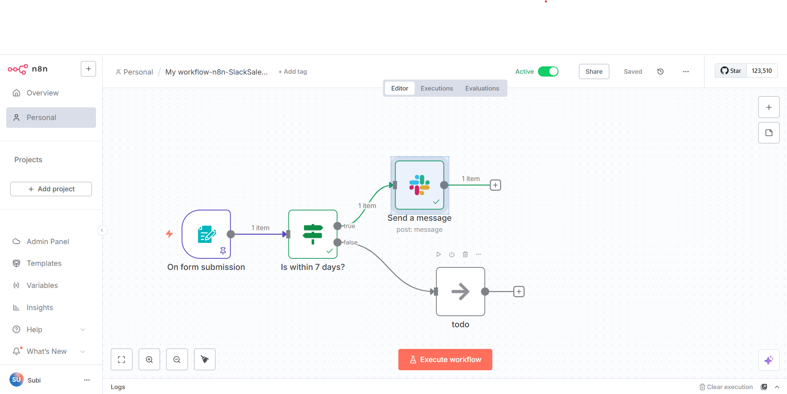

# n8n-Automation-Portfolio

This repo contains automation workflows I created using [n8n](https://n8n.io). I’m learning how to connect different tools without writing a lot of code, and these are some of the first workflows I’ve built.

---

## Projects included so far

### 1. Slack Sales Notification

This workflow sends a message to a Slack channel when someone submits a form with an installation request. It checks if the date is within 7 days, and if yes, notifies the sales team.

- Tools used: n8n form trigger, IF condition, Slack
- Includes basic conditional logic and data mapping
- Based on a tutorial by @theflowgrammer, but customized for my learning

📁 Folder: `slack-sales-notification`

---

## Why I built this

I'm exploring automation tools to reduce repetitive tasks and improve workflows for marketing, customer service, and small businesses. n8n is a good tool to learn because it connects with a lot of services and lets me use logic without much code.

---

## How to use these

- Import the `.json` file into your n8n account
- Add your own credentials (Slack, etc.)
- Adjust channel names or logic if needed
- Activate the workflow and run a test

---

## About Me

Hi, I'm Subi. I’ve worked in digital marketing and now I’m learning automation and AI tools to level up what I can do. This repo is part of my learning journey and portfolio.

Thanks for checking it out 🙂
